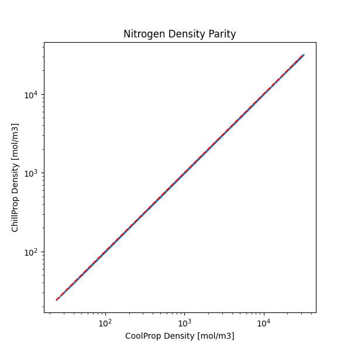
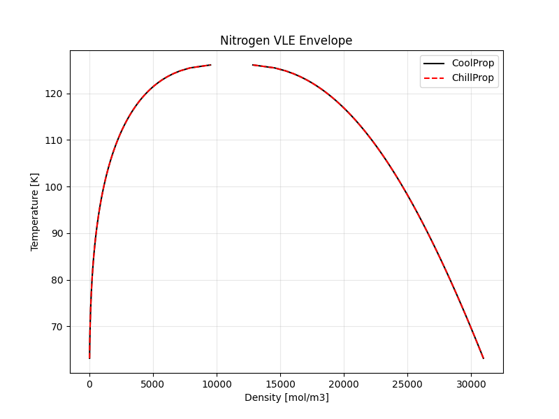
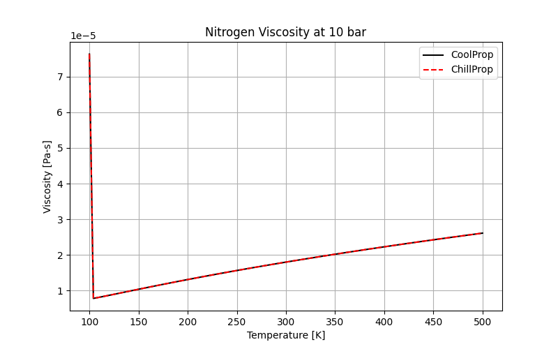
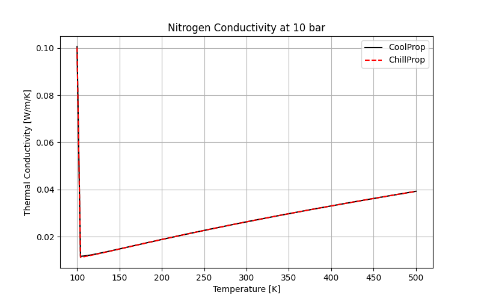
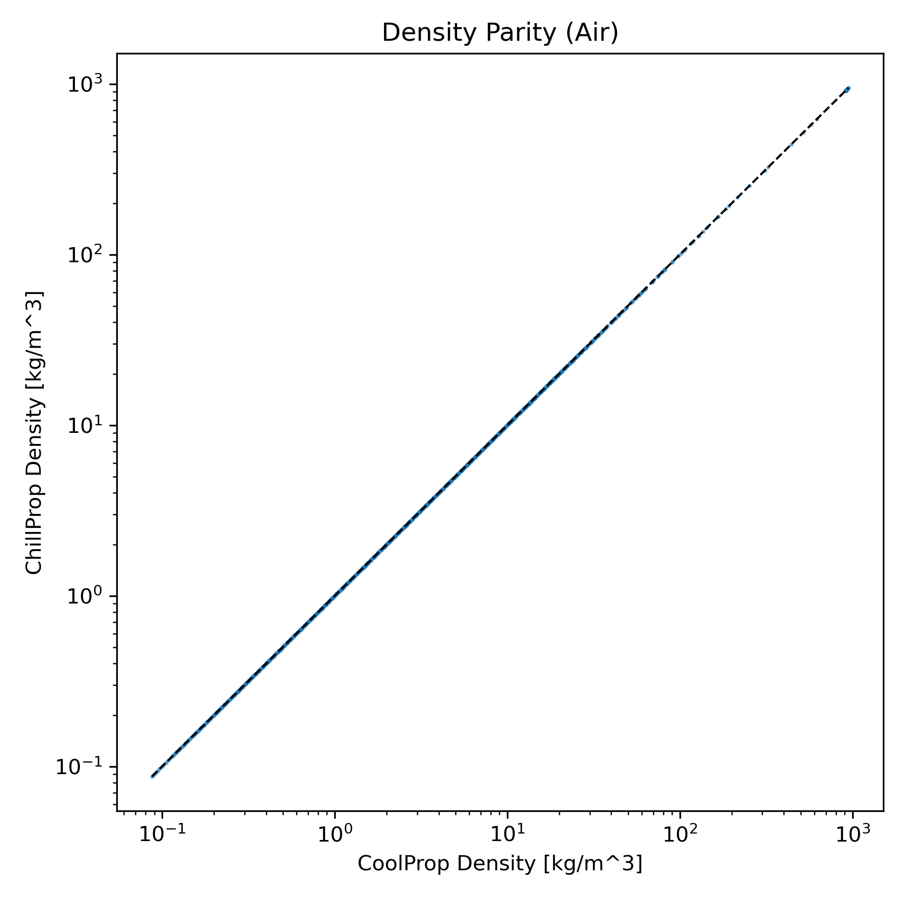
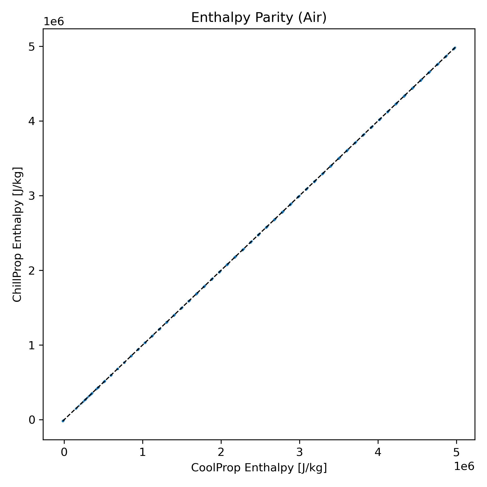
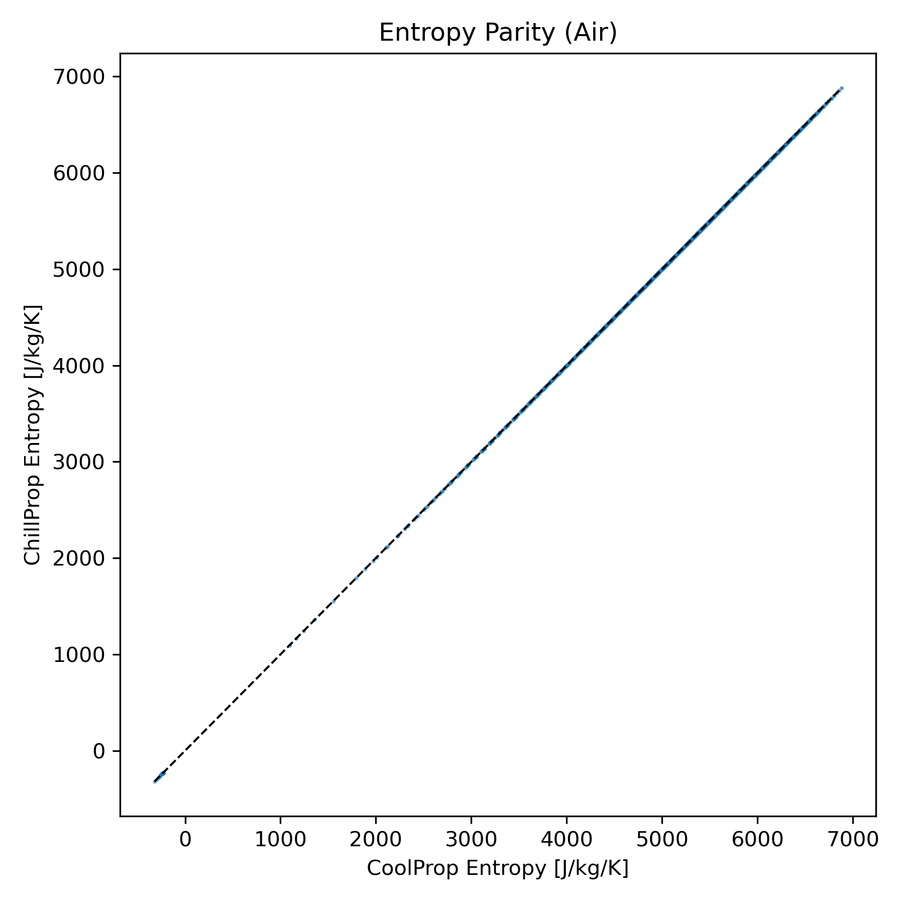
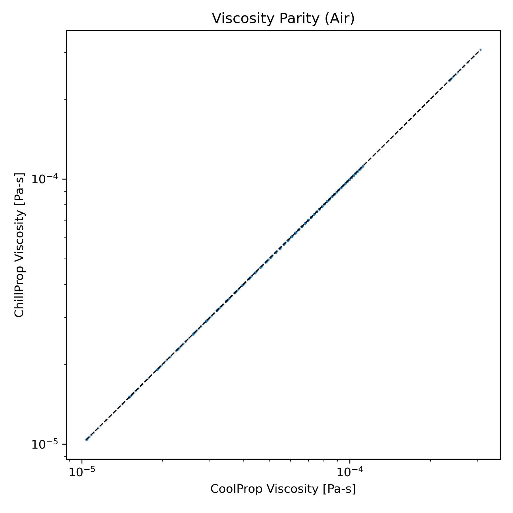
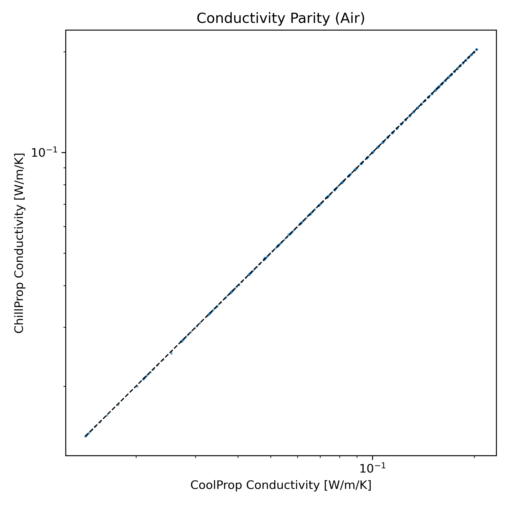

# Validation Report 📊

This document details the validation of ChillProp against CoolProp (v6.4.1) for the fluid **Nitrogen**.

## 1. Thermodynamic Properties (Density)

We validated the Equation of State (HEOS) parity by comparing density calculations across a wide range of pressures ($10^5$ to $10^{7.5}$ Pa) and temperatures ($T_{min}$ to $500$ K).

**Result:** Near-perfect alignment ($y=x$) confirms that the JAX implementation of the Ideal and Residual Helmholtz energy terms is correct.

## 2. Phase Equilibrium (VLE)

ChillProp implements a custom VLE solver using the Maxwell Construction (equality of pressure and chemical potential).

**Result:** ChillProp accurately reproduces the saturation dome. The critical point and phase boundaries match CoolProp's reference values.

## 3. Transport Properties

We implemented the specific viscosity and thermal conductivity models related to Nitrogen.

### Viscosity

**Model:** Collision Integral (Dilute) + Modified Batschinski-Hildebrand (Residual).
**Result:** Exact match with CoolProp.

### Thermal Conductivity

**Model:** Eta0-Polynomial (Dilute) + Polynomial-Exponential (Residual).
**Result:** High accuracy (< 0.5% relative error) across the gas and liquid regimes. Note that critical enhancement is currently simplified.

## 4. Performance Benchmarks

We compared the execution time for calculating density for **10,000 state points**.

| Method | Time (s) | Speedup |
| :--- | :---: | :---: |
| CoolProp (Serial) | 2.27s | 1.0x |
| ChillProp (Python Loop) | ~16s | 0.14x |
| **ChillProp (JAX Vectorized)** | **0.52s** | **4.4x** |

**Conclusion:** ChillProp provides a significant speedup when leveraging JAX's `vmap` and `jit` capabilities, even on CPU.

# Validation Report - Air 🌬️

We validated ChillProp against CoolProp (v6.4.1) for **Air**, a pseudo-pure fluid.

## 1. Thermodynamic Properties

High-precision parity was achieved for Air after implementing the `IdealGasHelmholtzPlanckEinsteinGeneralized` term, seamlessly enabling JAX `x64` precision globally, and adding low-temperature robust anchors for the superheated vapor density solver to prevent Newton-Raphson NaNs.

### Density and Enthalpy
Validation range: **70 K to 4000 K**, Pressures up to 20 MPa.

**Result:** Parity within machine precision (~1e-15 relative error) across liquid, vapor, and supercritical regions.

### Entropy

## 2. Transport Properties

### Viscosity and Conductivity

**Result:**
- **Viscosity:** Exact match (~1e-15).
- **Thermal Conductivity:** Excellent agreement (< 1.5% maximum error) using the natively JAX-differentiable Simplified Olchowy-Sengers (SOS) critical enhancement model, carefully reformulated to prevent boolean tracer evaluation bugs.
