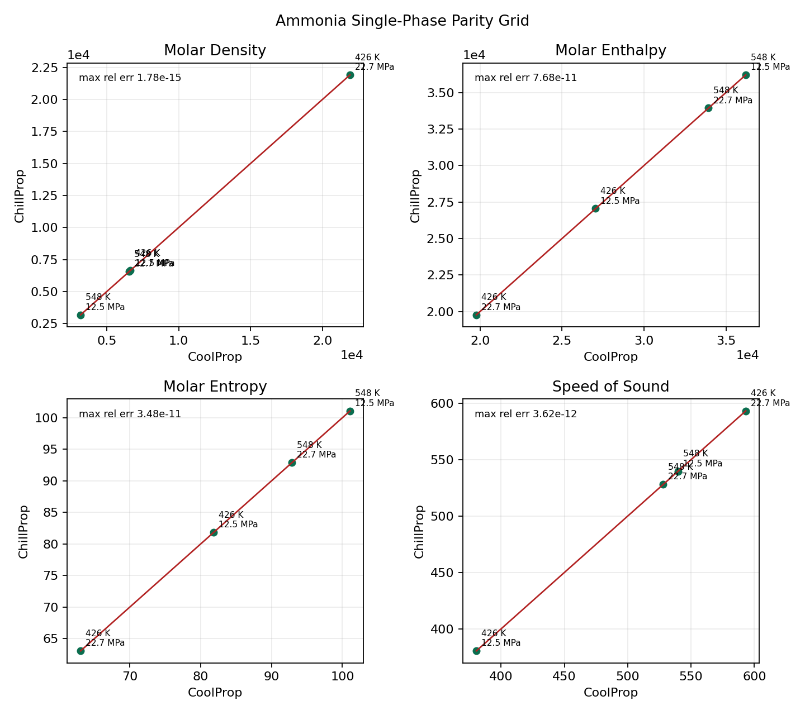
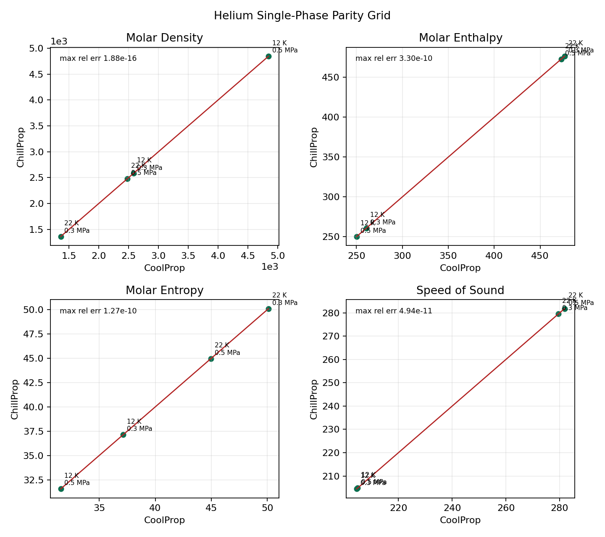
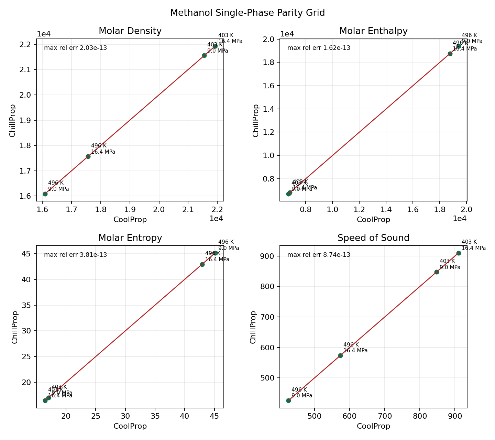
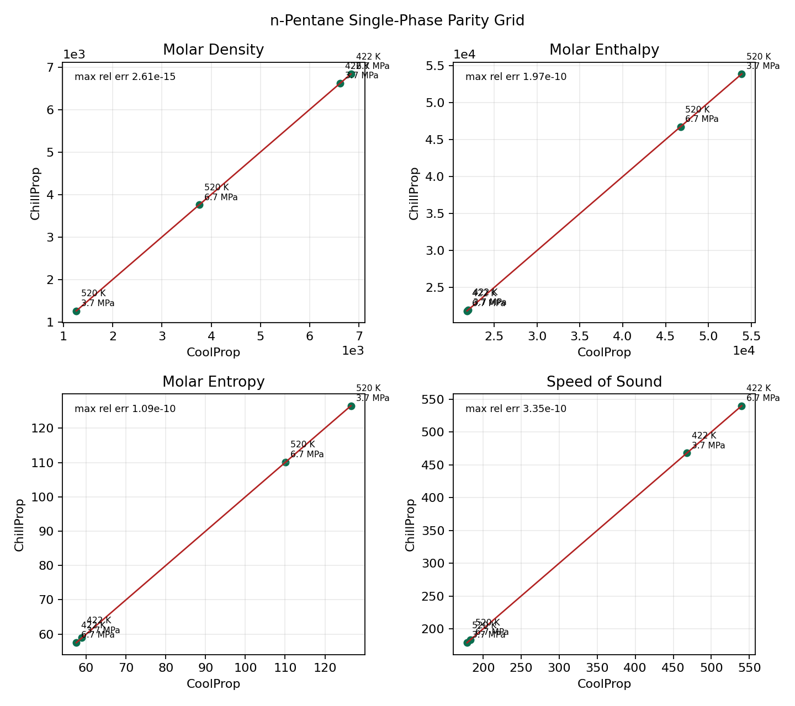
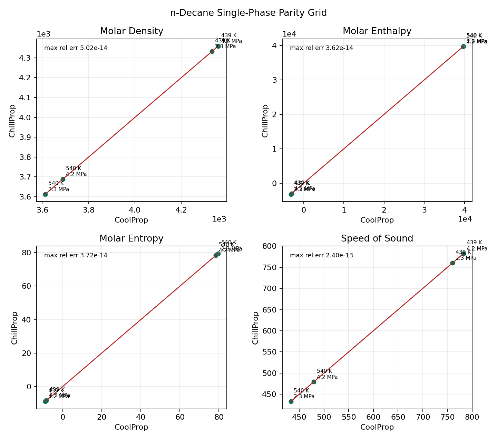
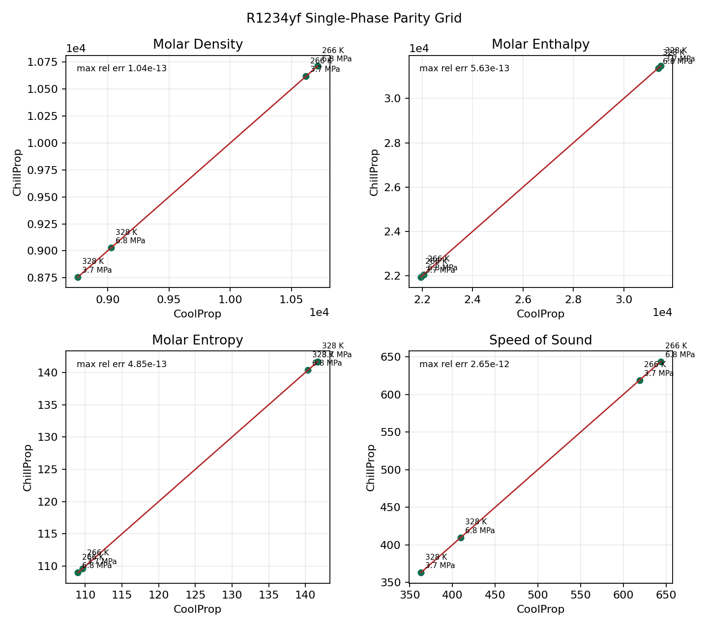

Validation
==========

This page summarizes the current automated parity coverage exercised against CoolProp for the documented ChillProp fluid catalog. The statistics and plot gallery on this page are derived from the same grids used by ``tests/test_highlevel_pure_jax.py``.

Catalog Snapshot
----------------

* Supported runtime fluids: ``44``
* Automated transport subset: ``6`` fluids
* Automated two-phase subset: ``28`` fluids

Supported fluids:

* ``Air``, ``Ammonia``, ``Argon``, ``CarbonDioxide``, ``CarbonMonoxide``, ``Cyclopentane``, ``Ethane``, ``Ethanol``, ``Ethylene``, ``HeavyWater``, ``Helium``, ``Hydrogen``, ``HydrogenSulfide``, ``IsoButane``, ``Isopentane``, ``Krypton``, ``Methane``, ``Methanol``, ``n-Butane``, ``n-Decane``, ``n-Dodecane``, ``n-Heptane``, ``n-Hexane``, ``n-Octane``, ``n-Pentane``, ``n-Undecane``, ``Neon``, ``Neopentane``, ``Nitrogen``, ``NitrousOxide``, ``Oxygen``, ``Propane``, ``Propylene``, ``R134a``, ``R32``, ``R1234yf``, ``R1234ze(E)``, ``R404A``, ``R407C``, ``R410A``, ``SulfurDioxide``, ``SulfurHexafluoride``, ``Water``, ``Xenon``

Automated transport subset:

* ``Argon``, ``Hydrogen``, ``n-Decane``, ``Nitrogen``, ``Oxygen``, ``Propane``

Automated two-phase subset:

* ``Ammonia``, ``Argon``, ``CarbonDioxide``, ``CarbonMonoxide``, ``Cyclopentane``, ``Ethane``, ``Ethylene``, ``HeavyWater``, ``Helium``, ``IsoButane``, ``Isopentane``, ``Methane``, ``n-Butane``, ``n-Decane``, ``n-Octane``, ``n-Pentane``, ``n-Undecane``, ``Neon``, ``Neopentane``, ``Nitrogen``, ``Propane``, ``Propylene``, ``R32``, ``R1234yf``, ``SulfurDioxide``, ``SulfurHexafluoride``, ``Water``, ``Xenon``

Validation Scope
----------------

* Trivial fluid constants: 11 checks per fluid.
* Single-phase core parity grid: 4 state points by 20 outputs per supported fluid.
* Transport parity grid: 4 state points by 3 outputs for the dedicated transport subset.
* Two-phase parity grid: 6 state points by 10 outputs for the documented two-phase subset.

Tolerances
----------

+----------------------------+-------------------+-----------------------------------------------------------------------+
| Category                   | Default tolerance | Notes                                                                 |
+============================+===================+=======================================================================+
| Trivial outputs            | ``3e-2``          | Scalar constants such as critical properties and molar mass           |
+----------------------------+-------------------+-----------------------------------------------------------------------+
| Single-phase core outputs  | ``5e-8``          | Property-specific relaxations are applied in the test suite           |
+----------------------------+-------------------+-----------------------------------------------------------------------+
| Two-phase outputs          | ``1e-3``          | ``Q`` uses ``1e-4``; only the documented subset is enforced           |
+----------------------------+-------------------+-----------------------------------------------------------------------+
| Transport outputs          | ``5e-3``          | Viscosity, conductivity, and Prandtl number for the transport subset  |
+----------------------------+-------------------+-----------------------------------------------------------------------+

Supported Materials Summary
---------------------------

.. list-table::
   :header-rows: 1
   :widths: 16 14 16 16 16 32

   * - Fluid
     - Trivial max rel err
     - Single-phase max rel err
     - Transport max rel err
     - Two-phase max rel err
     - Notes
   * - ``Air``
     - ``0.000e+00``
     - ``2.357e-08``
     - ``n/a``
     - ``n/a``
     - Transport properties may be implemented, but this fluid is outside the automated transport parity subset.; CoolProp does not report this fluid as pure, so the automated two-phase grid is not applied.
   * - ``Ammonia``
     - ``2.558e-05``
     - ``1.259e-10``
     - ``n/a``
     - ``3.879e-07``
     - Transport properties may be implemented, but this fluid is outside the automated transport parity subset.
   * - ``Argon``
     - ``1.120e-07``
     - ``7.508e-09``
     - ``4.493e-08``
     - ``6.794e-12``
     - Full documented suite for current subsets
   * - ``CarbonDioxide``
     - ``2.205e-07``
     - ``2.871e-11``
     - ``n/a``
     - ``5.990e-07``
     - Transport properties may be implemented, but this fluid is outside the automated transport parity subset.
   * - ``CarbonMonoxide``
     - ``1.199e-03``
     - ``1.486e-09``
     - ``n/a``
     - ``2.335e-04``
     - Transport properties may be implemented, but this fluid is outside the automated transport parity subset.
   * - ``Cyclopentane``
     - ``9.602e-07``
     - ``6.513e-11``
     - ``n/a``
     - ``2.093e-04``
     - Transport properties may be implemented, but this fluid is outside the automated transport parity subset.
   * - ``Ethane``
     - ``4.560e-09``
     - ``7.822e-09``
     - ``n/a``
     - ``7.391e-12``
     - Transport properties may be implemented, but this fluid is outside the automated transport parity subset.
   * - ``Ethanol``
     - ``6.285e-04``
     - ``7.158e-13``
     - ``n/a``
     - ``n/a``
     - Transport properties may be implemented, but this fluid is outside the automated transport parity subset.; This fluid is outside the documented automated two-phase subset because its current saturation parity exceeds the published tolerance.
   * - ``Ethylene``
     - ``2.139e-05``
     - ``4.154e-12``
     - ``n/a``
     - ``1.422e-10``
     - Transport properties may be implemented, but this fluid is outside the automated transport parity subset.
   * - ``HeavyWater``
     - ``2.088e-10``
     - ``3.679e-12``
     - ``n/a``
     - ``1.092e-05``
     - Transport properties may be implemented, but this fluid is outside the automated transport parity subset.
   * - ``Helium``
     - ``1.437e-05``
     - ``5.620e-10``
     - ``n/a``
     - ``5.561e-04``
     - Transport properties may be implemented, but this fluid is outside the automated transport parity subset.
   * - ``Hydrogen``
     - ``3.270e-05``
     - ``1.276e-10``
     - ``2.876e-05``
     - ``n/a``
     - This fluid is outside the documented automated two-phase subset because its current saturation parity exceeds the published tolerance.
   * - ``HydrogenSulfide``
     - ``1.254e-04``
     - ``1.886e-13``
     - ``n/a``
     - ``n/a``
     - Transport properties may be implemented, but this fluid is outside the automated transport parity subset.; This fluid is outside the documented automated two-phase subset because its current saturation parity exceeds the published tolerance.
   * - ``IsoButane``
     - ``1.716e-05``
     - ``7.918e-11``
     - ``n/a``
     - ``5.168e-04``
     - Transport properties may be implemented, but this fluid is outside the automated transport parity subset.
   * - ``Isopentane``
     - ``6.430e-05``
     - ``2.594e-11``
     - ``n/a``
     - ``3.358e-04``
     - Transport properties may be implemented, but this fluid is outside the automated transport parity subset.
   * - ``Krypton``
     - ``7.827e-05``
     - ``7.662e-09``
     - ``n/a``
     - ``n/a``
     - Transport properties may be implemented, but this fluid is outside the automated transport parity subset.; This fluid is outside the documented automated two-phase subset because its current saturation parity exceeds the published tolerance.
   * - ``Methane``
     - ``1.031e-07``
     - ``1.720e-09``
     - ``n/a``
     - ``1.622e-05``
     - Transport properties may be implemented, but this fluid is outside the automated transport parity subset.
   * - ``Methanol``
     - ``1.534e-02``
     - ``2.341e-11``
     - ``n/a``
     - ``n/a``
     - Transport properties may be implemented, but this fluid is outside the automated transport parity subset.; This fluid is outside the documented automated two-phase subset because its current saturation parity exceeds the published tolerance.
   * - ``n-Butane``
     - ``4.588e-09``
     - ``2.890e-09``
     - ``n/a``
     - ``7.682e-12``
     - Transport properties may be implemented, but this fluid is outside the automated transport parity subset.
   * - ``n-Decane``
     - ``7.915e-04``
     - ``1.172e-12``
     - ``1.779e-05``
     - ``1.531e-04``
     - Full documented suite for current subsets
   * - ``n-Dodecane``
     - ``3.134e-04``
     - ``1.604e-10``
     - ``n/a``
     - ``n/a``
     - Transport properties may be implemented, but this fluid is outside the automated transport parity subset.; This fluid is outside the documented automated two-phase subset because its current saturation parity exceeds the published tolerance.
   * - ``n-Heptane``
     - ``1.364e-02``
     - ``1.880e-10``
     - ``n/a``
     - ``n/a``
     - Transport properties may be implemented, but this fluid is outside the automated transport parity subset.; This fluid is outside the documented automated two-phase subset because its current saturation parity exceeds the published tolerance.
   * - ``n-Hexane``
     - ``1.753e-09``
     - ``6.989e-11``
     - ``n/a``
     - ``n/a``
     - Transport properties may be implemented, but this fluid is outside the automated transport parity subset.; This fluid is outside the documented automated two-phase subset because its current saturation parity exceeds the published tolerance.
   * - ``n-Octane``
     - ``7.724e-10``
     - ``1.062e-10``
     - ``n/a``
     - ``4.486e-04``
     - Transport properties may be implemented, but this fluid is outside the automated transport parity subset.
   * - ``n-Pentane``
     - ``3.305e-09``
     - ``3.354e-10``
     - ``n/a``
     - ``1.320e-04``
     - Transport properties may be implemented, but this fluid is outside the automated transport parity subset.
   * - ``n-Undecane``
     - ``2.620e-05``
     - ``2.182e-11``
     - ``n/a``
     - ``1.643e-05``
     - Transport properties may be implemented, but this fluid is outside the automated transport parity subset.
   * - ``Neon``
     - ``1.588e-04``
     - ``1.355e-11``
     - ``n/a``
     - ``5.153e-06``
     - Transport properties may be implemented, but this fluid is outside the automated transport parity subset.
   * - ``Neopentane``
     - ``9.306e-05``
     - ``2.436e-11``
     - ``n/a``
     - ``2.032e-04``
     - Transport properties may be implemented, but this fluid is outside the automated transport parity subset.
   * - ``Nitrogen``
     - ``1.309e-07``
     - ``3.271e-09``
     - ``3.779e-08``
     - ``5.088e-09``
     - Full documented suite for current subsets
   * - ``NitrousOxide``
     - ``2.530e-05``
     - ``2.225e-11``
     - ``n/a``
     - ``n/a``
     - Transport properties may be implemented, but this fluid is outside the automated transport parity subset.; This fluid is outside the documented automated two-phase subset because its current saturation parity exceeds the published tolerance.
   * - ``Oxygen``
     - ``6.758e-04``
     - ``4.389e-09``
     - ``1.313e-03``
     - ``n/a``
     - This fluid is outside the documented automated two-phase subset because its current saturation parity exceeds the published tolerance.
   * - ``Propane``
     - ``8.156e-06``
     - ``4.451e-12``
     - ``6.556e-04``
     - ``7.569e-06``
     - Full documented suite for current subsets
   * - ``Propylene``
     - ``1.533e-06``
     - ``1.392e-11``
     - ``n/a``
     - ``1.765e-04``
     - Transport properties may be implemented, but this fluid is outside the automated transport parity subset.
   * - ``R134a``
     - ``5.255e-06``
     - ``9.496e-13``
     - ``n/a``
     - ``n/a``
     - Transport properties may be implemented, but this fluid is outside the automated transport parity subset.; This fluid is outside the documented automated two-phase subset because its current saturation parity exceeds the published tolerance.
   * - ``R32``
     - ``1.116e-04``
     - ``1.481e-12``
     - ``n/a``
     - ``1.909e-06``
     - Transport properties may be implemented, but this fluid is outside the automated transport parity subset.
   * - ``R1234yf``
     - ``6.372e-04``
     - ``4.442e-11``
     - ``n/a``
     - ``4.717e-05``
     - Transport properties may be implemented, but this fluid is outside the automated transport parity subset.
   * - ``R1234ze(E)``
     - ``1.392e-04``
     - ``1.765e-11``
     - ``n/a``
     - ``n/a``
     - Transport properties may be implemented, but this fluid is outside the automated transport parity subset.; This fluid is outside the documented automated two-phase subset because its current saturation parity exceeds the published tolerance.
   * - ``R404A``
     - ``0.000e+00``
     - ``1.143e-12``
     - ``n/a``
     - ``n/a``
     - Transport properties may be implemented, but this fluid is outside the automated transport parity subset.; CoolProp does not report this fluid as pure, so the automated two-phase grid is not applied.
   * - ``R407C``
     - ``0.000e+00``
     - ``2.893e-13``
     - ``n/a``
     - ``n/a``
     - Transport properties may be implemented, but this fluid is outside the automated transport parity subset.; CoolProp does not report this fluid as pure, so the automated two-phase grid is not applied.
   * - ``R410A``
     - ``0.000e+00``
     - ``1.780e-13``
     - ``n/a``
     - ``n/a``
     - Transport properties may be implemented, but this fluid is outside the automated transport parity subset.; CoolProp does not report this fluid as pure, so the automated two-phase grid is not applied.
   * - ``SulfurDioxide``
     - ``1.093e-06``
     - ``5.541e-12``
     - ``n/a``
     - ``7.016e-04``
     - Transport properties may be implemented, but this fluid is outside the automated transport parity subset.
   * - ``SulfurHexafluoride``
     - ``4.731e-11``
     - ``1.843e-09``
     - ``n/a``
     - ``1.533e-10``
     - Transport properties may be implemented, but this fluid is outside the automated transport parity subset.
   * - ``Water``
     - ``1.018e-13``
     - ``5.327e-11``
     - ``n/a``
     - ``3.483e-08``
     - Transport properties may be implemented, but this fluid is outside the automated transport parity subset.
   * - ``Xenon``
     - ``1.478e-05``
     - ``7.911e-09``
     - ``n/a``
     - ``2.751e-04``
     - Transport properties may be implemented, but this fluid is outside the automated transport parity subset.

Plot Gallery
------------

The complete per-fluid single-phase parity plot set is stored in ``docs/plots/validated``. Selected expansion-era plots are shown below.

Ammonia
^^^^^^^

Helium
^^^^^^

Methanol
^^^^^^^^

n-Pentane
^^^^^^^^^

n-Decane
^^^^^^^^

R1234yf
^^^^^^^

