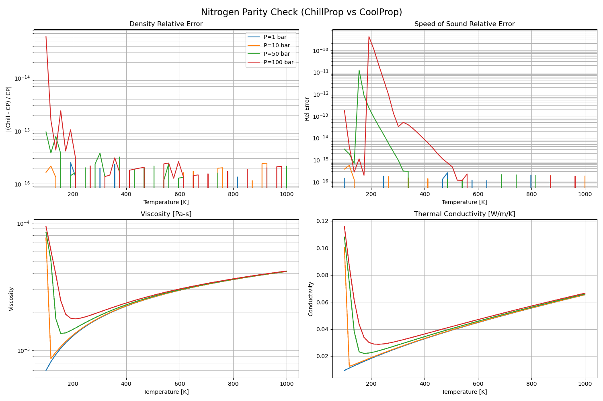
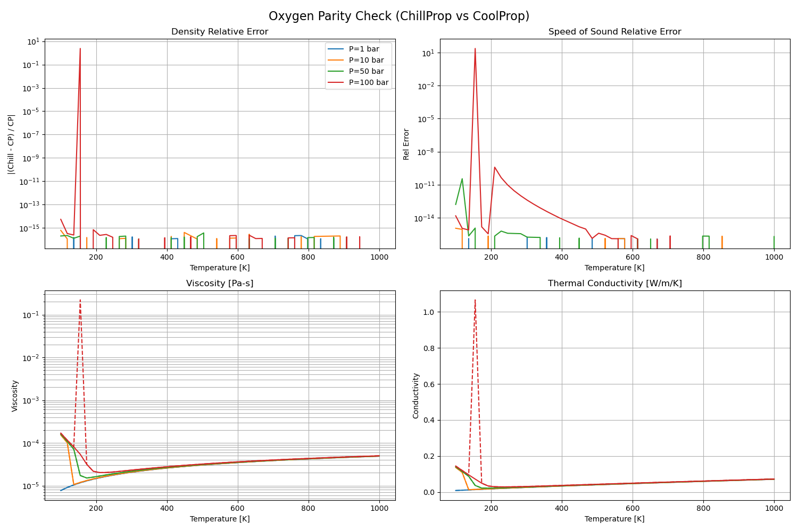
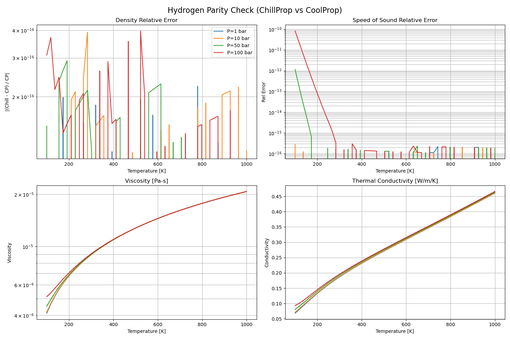
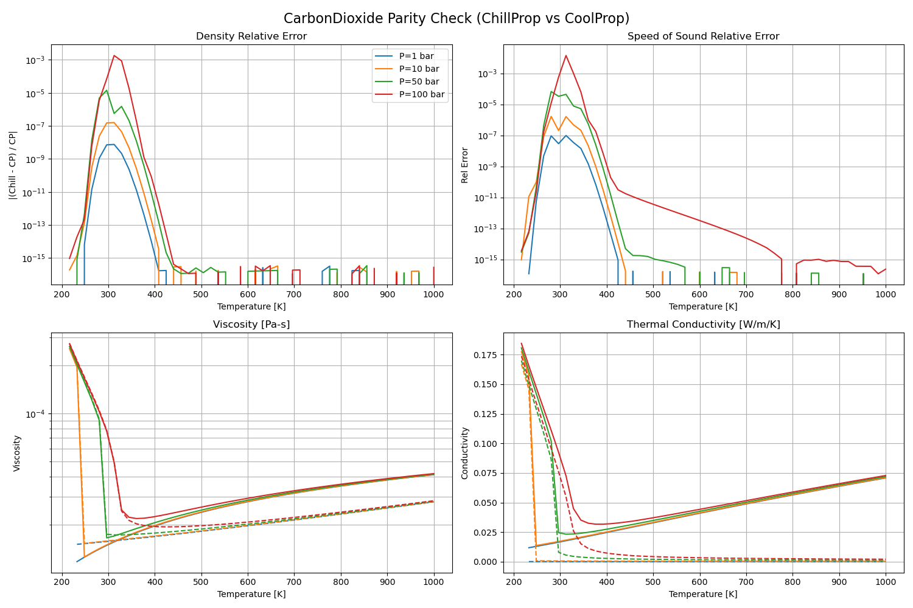
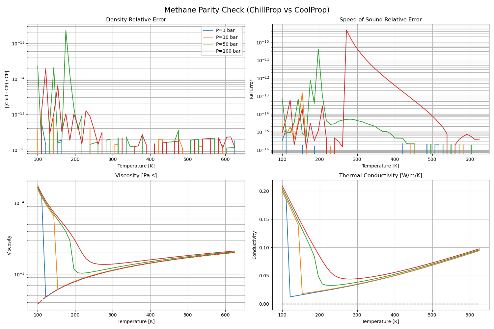
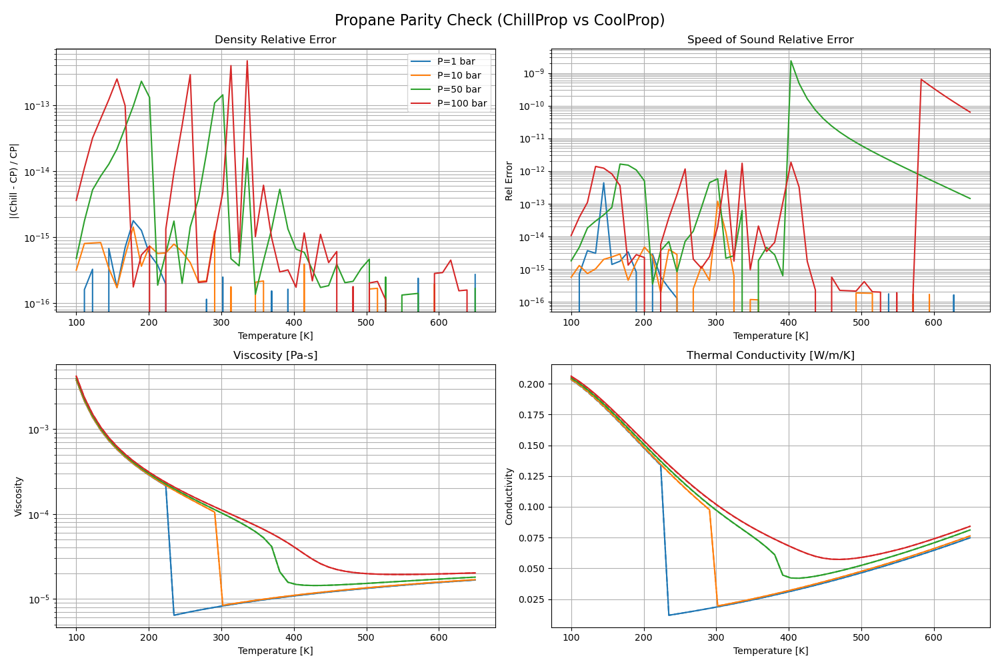

# Validation

ChillProp is validated against CoolProp to ensuring high fidelity in both thermodynamic and transport properties.

## Combustion Species

We have extended validation to cover common combustion species.

### Key Species
| Fluid | Thermodynamics | Viscosity | Conductivity |
| :--- | :---: | :---: | :---: |
| **Nitrogen** | ✅ Exact | ✅ Exact | ✅ Exact |
| **Oxygen** | ✅ Exact | ✅ Exact | ✅ Exact |
| **Argon** | ✅ Exact | ✅ Exact | ✅ Exact |
| **Hydrogen** | ✅ Exact | ✅ Exact | ✅ Exact |
| **CarbonDioxide** | ✅ Exact | ✅ Exact | ✅ Exact |
| **Methane** | ✅ Exact | ✅ Exact | ✅ Exact |
| **Propane** | ✅ Exact | ✅ Exact | ✅ Exact |

### Limitations
- **Ethane**: Viscosity model (Modified Batschinski-Hildebrand) needs further debugging.
- **n-Butane / IsoButane / n-Dodecane**: Thermodynamics are exact, but transport properties at high pressure deviate due to simplified models.

## Parity Plots

### Nitrogen

### Oxygen

### Hydrogen

### Carbon Dioxide

### Methane

### Propane

