# Validation

This page summarizes the automated parity coverage exercised against CoolProp for the currently documented supported materials. The statistics on this page are generated from the same state grids used by the regression suite in `tests/test_highlevel_pure_jax.py`.

## Validation Scope

- Trivial fluid constants: 11 checks per fluid
- Single-phase core parity grid: 4 state points x 20 outputs per fluid
- Transport parity grid: 4 state points x 3 outputs for `Argon`, `Hydrogen`, `Nitrogen`, `Oxygen`, and `Propane`
- Two-phase parity grid: 6 state points x 10 outputs for fluids that CoolProp reports as pure

## Tolerances

| Category | Default tolerance | Notes |
| :--- | ---: | :--- |
| Trivial outputs | `3e-2` | Applied to scalar constants such as critical properties and molar mass |
| Single-phase core outputs | `5e-8` | Property-specific relaxations are applied where documented in the test suite |
| Two-phase outputs | `1e-3` | `Q` uses `1e-4` |
| Transport outputs | `5e-3` | Applied to viscosity, conductivity, and Prandtl number |

## Supported Materials Summary

| Fluid | Trivial max rel err | Single-phase max rel err | Transport max rel err | Two-phase max rel err | Notes |
| :--- | ---: | ---: | ---: | ---: | :--- |
| `Air` | `0.000e+00` | `2.357e-08` | `n/a` | `n/a` | transport grid not in automated suite; two-phase grid not applicable in current suite |
| `Argon` | `1.120e-07` | `7.508e-09` | `4.493e-08` | `5.121e-13` | full documented suite |
| `CarbonDioxide` | `2.205e-07` | `2.871e-11` | `n/a` | `3.574e-13` | transport grid not in automated suite |
| `Ethane` | `4.560e-09` | `7.822e-09` | `n/a` | `4.433e-11` | transport grid not in automated suite |
| `Hydrogen` | `3.946e-04` | `1.276e-10` | `7.179e-06` | `5.855e-14` | full documented suite |
| `IsoButane` | `1.716e-05` | `7.918e-11` | `n/a` | `5.168e-04` | transport grid not in automated suite |
| `Methane` | `9.522e-07` | `1.720e-09` | `n/a` | `3.701e-13` | transport grid not in automated suite |
| `n-Butane` | `4.588e-09` | `2.890e-09` | `n/a` | `5.696e-12` | transport grid not in automated suite |
| `n-Dodecane` | `3.134e-04` | `1.604e-10` | `n/a` | `3.231e-11` | transport grid not in automated suite |
| `Nitrogen` | `1.309e-07` | `3.271e-09` | `3.780e-08` | `1.116e-12` | full documented suite |
| `Oxygen` | `2.157e-02` | `4.389e-09` | `3.115e-08` | `3.401e-12` | full documented suite |
| `Propane` | `8.156e-06` | `4.451e-12` | `6.556e-04` | `2.847e-10` | full documented suite |
| `Water` | `2.865e-09` | `5.327e-11` | `n/a` | `3.974e-11` | transport grid not in automated suite |

## Implementation Notes

- The single-phase parity plots below show `D`, `H`, `S`, and `A` over the automated state grid for each documented supported material.
- Transport parity is summarized numerically in the table above and validated in the automated suite only for the dedicated transport subset.
- Two-phase statistics are summarized numerically for fluids covered by the automated saturation grid.
- Current compatibility limits relative to CoolProp are documented in [Implementation Gaps](Implementation_Gaps.md).

## Per-Fluid Statistics and Plots

### `Air`

| Metric | Value |
| :--- | ---: |
| Trivial max relative error | `0.000e+00` |
| Single-phase max relative error | `2.357e-08` |
| Transport max relative error | `n/a` |
| Two-phase max relative error | `n/a` |

- Transport properties are available for some fluids, but the automated parity grid currently covers transport only for Argon, Hydrogen, Nitrogen, Oxygen, and Propane.
- The two-phase grid is not part of the automated parity suite for this fluid because CoolProp does not report it as a pure fluid.

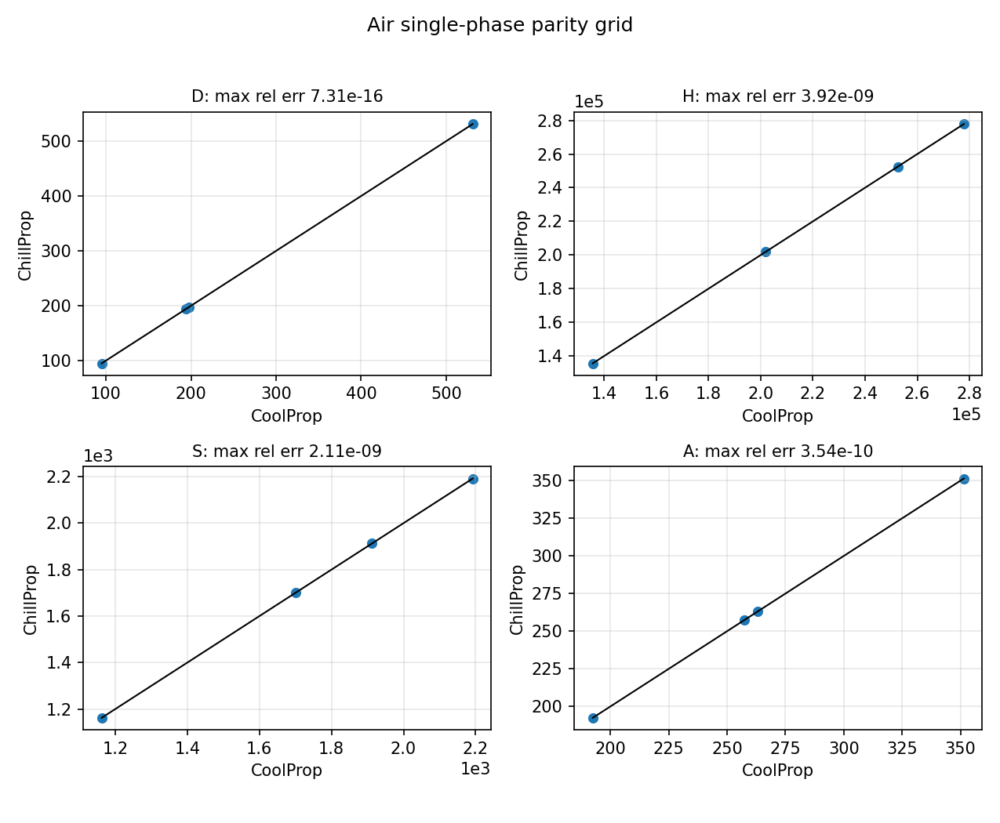

### `Argon`

| Metric | Value |
| :--- | ---: |
| Trivial max relative error | `1.120e-07` |
| Single-phase max relative error | `7.508e-09` |
| Transport max relative error | `4.493e-08` |
| Two-phase max relative error | `5.121e-13` |

- No additional caveats for the documented validation scope.

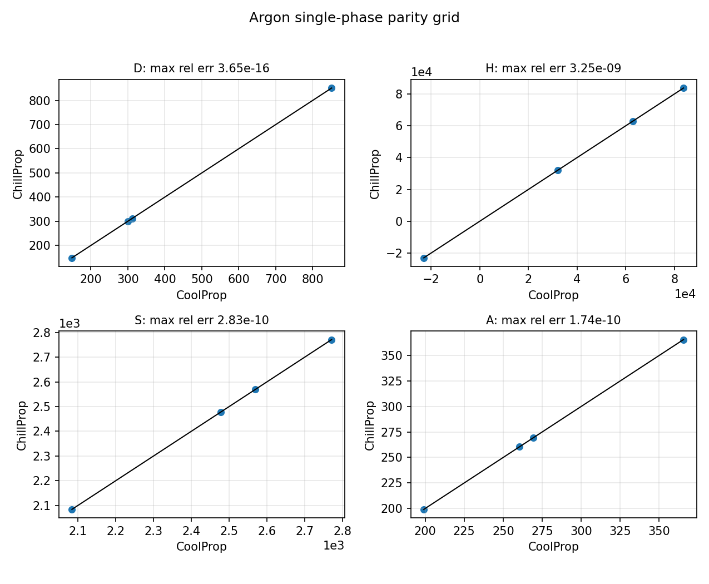

### `CarbonDioxide`

| Metric | Value |
| :--- | ---: |
| Trivial max relative error | `2.205e-07` |
| Single-phase max relative error | `2.871e-11` |
| Transport max relative error | `n/a` |
| Two-phase max relative error | `3.574e-13` |

- Transport properties are available for some fluids, but the automated parity grid currently covers transport only for Argon, Hydrogen, Nitrogen, Oxygen, and Propane.

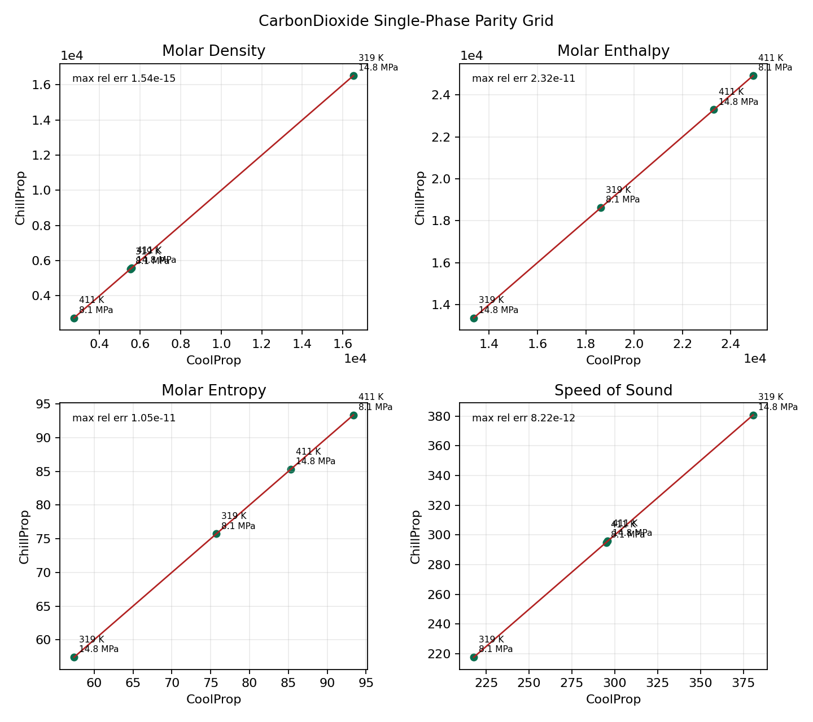

### `Ethane`

| Metric | Value |
| :--- | ---: |
| Trivial max relative error | `4.560e-09` |
| Single-phase max relative error | `7.822e-09` |
| Transport max relative error | `n/a` |
| Two-phase max relative error | `4.433e-11` |

- Transport properties are available for some fluids, but the automated parity grid currently covers transport only for Argon, Hydrogen, Nitrogen, Oxygen, and Propane.

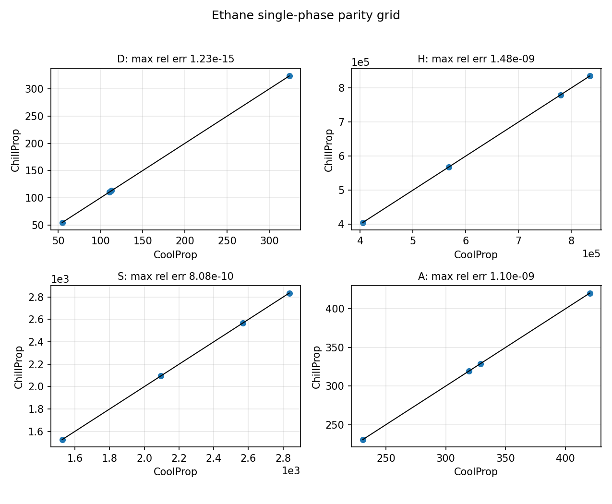

### `Hydrogen`

| Metric | Value |
| :--- | ---: |
| Trivial max relative error | `3.946e-04` |
| Single-phase max relative error | `1.276e-10` |
| Transport max relative error | `7.179e-06` |
| Two-phase max relative error | `5.855e-14` |

- No additional caveats for the documented validation scope.

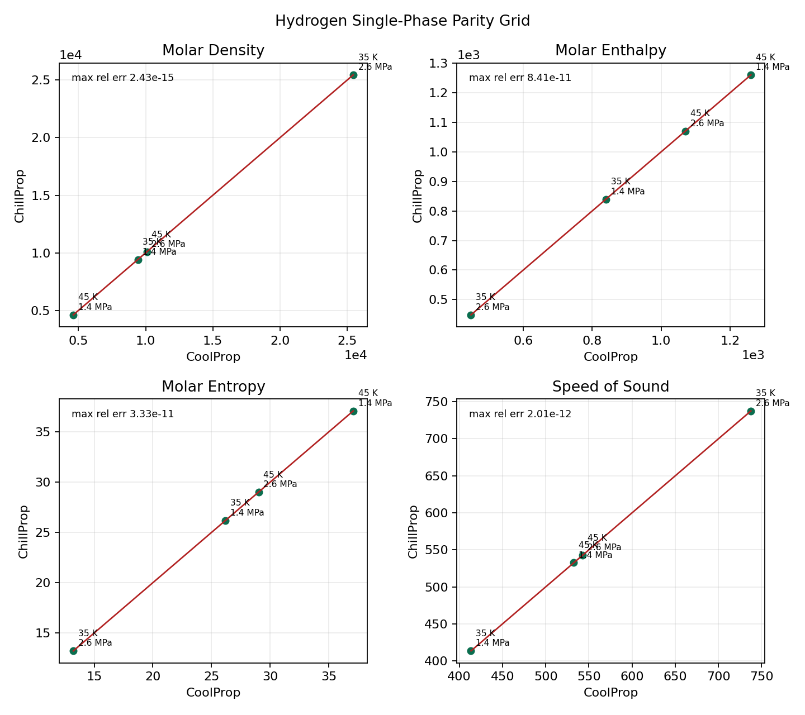

### `IsoButane`

| Metric | Value |
| :--- | ---: |
| Trivial max relative error | `1.716e-05` |
| Single-phase max relative error | `7.918e-11` |
| Transport max relative error | `n/a` |
| Two-phase max relative error | `5.168e-04` |

- Transport properties are available for some fluids, but the automated parity grid currently covers transport only for Argon, Hydrogen, Nitrogen, Oxygen, and Propane.

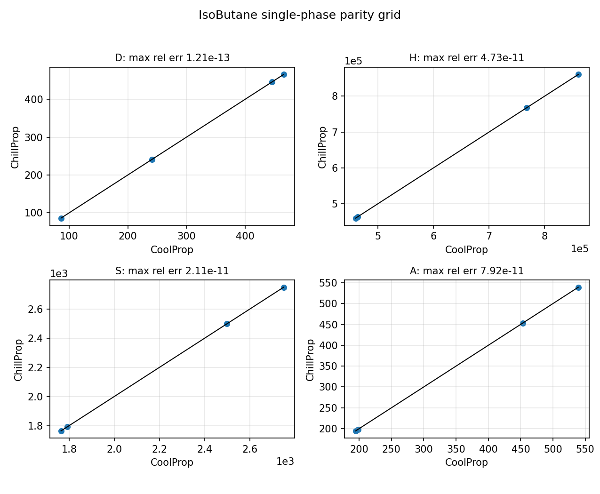

### `Methane`

| Metric | Value |
| :--- | ---: |
| Trivial max relative error | `9.522e-07` |
| Single-phase max relative error | `1.720e-09` |
| Transport max relative error | `n/a` |
| Two-phase max relative error | `3.701e-13` |

- Transport properties are available for some fluids, but the automated parity grid currently covers transport only for Argon, Hydrogen, Nitrogen, Oxygen, and Propane.

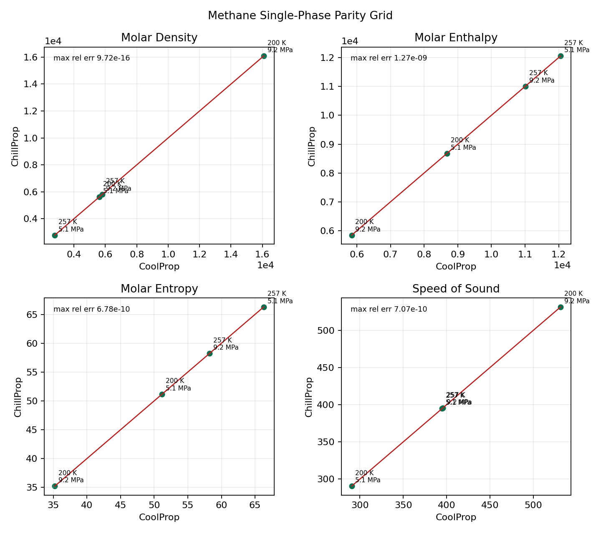

### `n-Butane`

| Metric | Value |
| :--- | ---: |
| Trivial max relative error | `4.588e-09` |
| Single-phase max relative error | `2.890e-09` |
| Transport max relative error | `n/a` |
| Two-phase max relative error | `5.696e-12` |

- Transport properties are available for some fluids, but the automated parity grid currently covers transport only for Argon, Hydrogen, Nitrogen, Oxygen, and Propane.

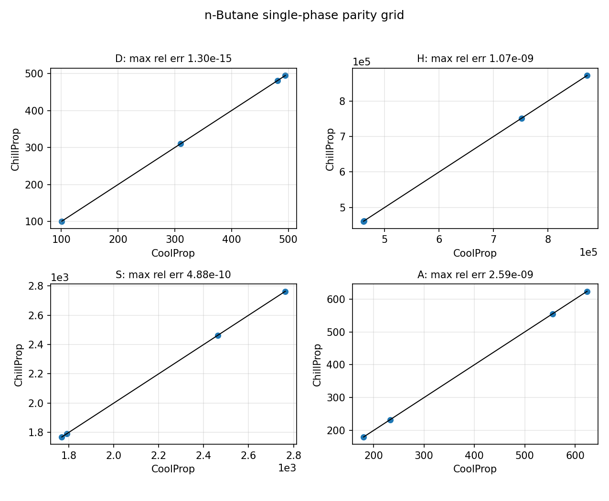

### `n-Dodecane`

| Metric | Value |
| :--- | ---: |
| Trivial max relative error | `3.134e-04` |
| Single-phase max relative error | `1.604e-10` |
| Transport max relative error | `n/a` |
| Two-phase max relative error | `3.231e-11` |

- Transport properties are available for some fluids, but the automated parity grid currently covers transport only for Argon, Hydrogen, Nitrogen, Oxygen, and Propane.

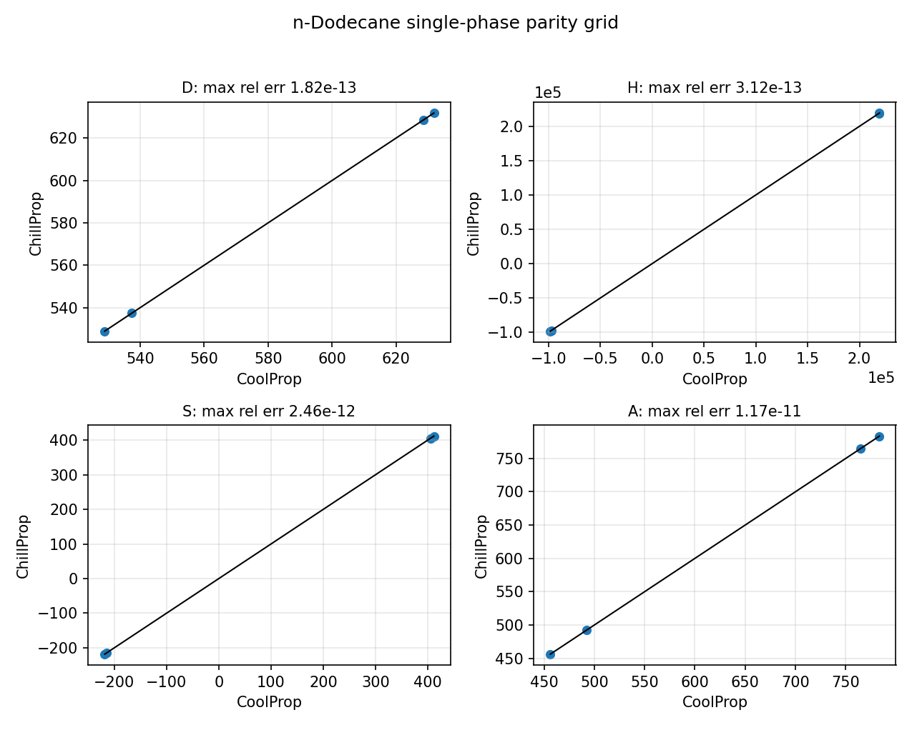

### `Nitrogen`

| Metric | Value |
| :--- | ---: |
| Trivial max relative error | `1.309e-07` |
| Single-phase max relative error | `3.271e-09` |
| Transport max relative error | `3.780e-08` |
| Two-phase max relative error | `1.116e-12` |

- No additional caveats for the documented validation scope.

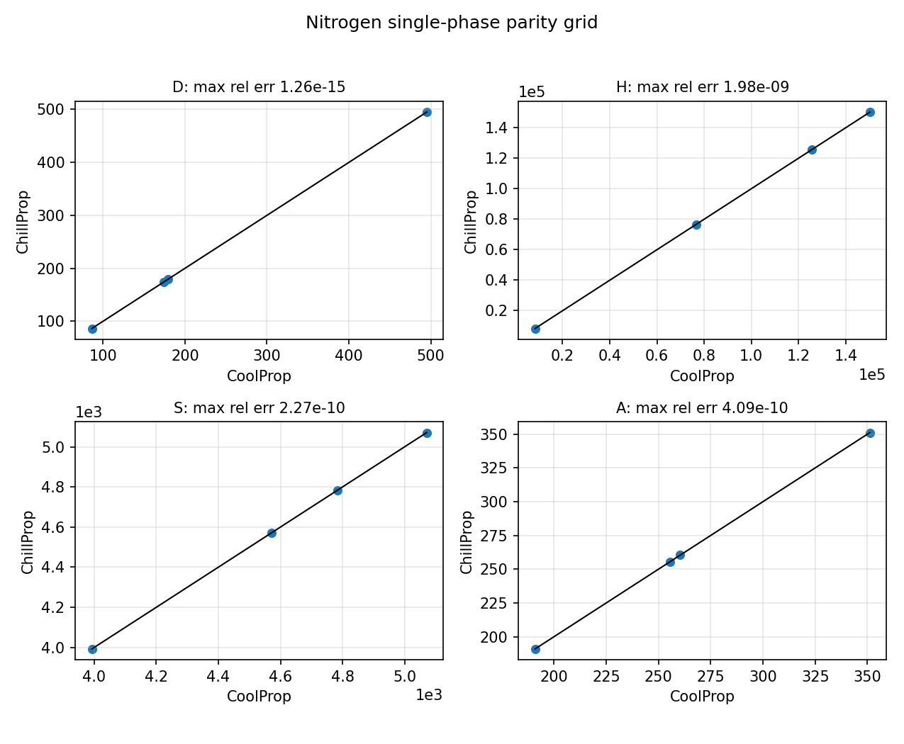

### `Oxygen`

| Metric | Value |
| :--- | ---: |
| Trivial max relative error | `2.157e-02` |
| Single-phase max relative error | `4.389e-09` |
| Transport max relative error | `3.115e-08` |
| Two-phase max relative error | `3.401e-12` |

- No additional caveats for the documented validation scope.

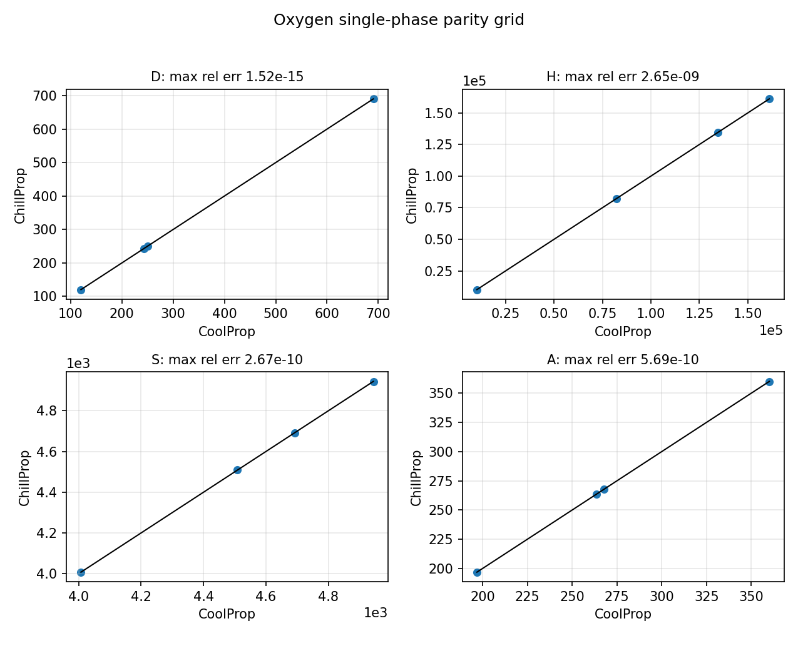

### `Propane`

| Metric | Value |
| :--- | ---: |
| Trivial max relative error | `8.156e-06` |
| Single-phase max relative error | `4.451e-12` |
| Transport max relative error | `6.556e-04` |
| Two-phase max relative error | `2.847e-10` |

- No additional caveats for the documented validation scope.

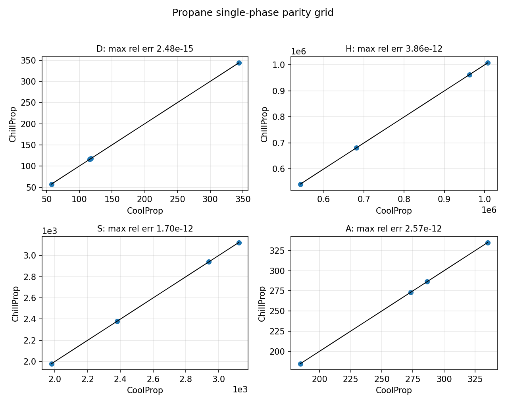

### `Water`

| Metric | Value |
| :--- | ---: |
| Trivial max relative error | `2.865e-09` |
| Single-phase max relative error | `5.327e-11` |
| Transport max relative error | `n/a` |
| Two-phase max relative error | `3.974e-11` |

- Transport properties are available for some fluids, but the automated parity grid currently covers transport only for Argon, Hydrogen, Nitrogen, Oxygen, and Propane.

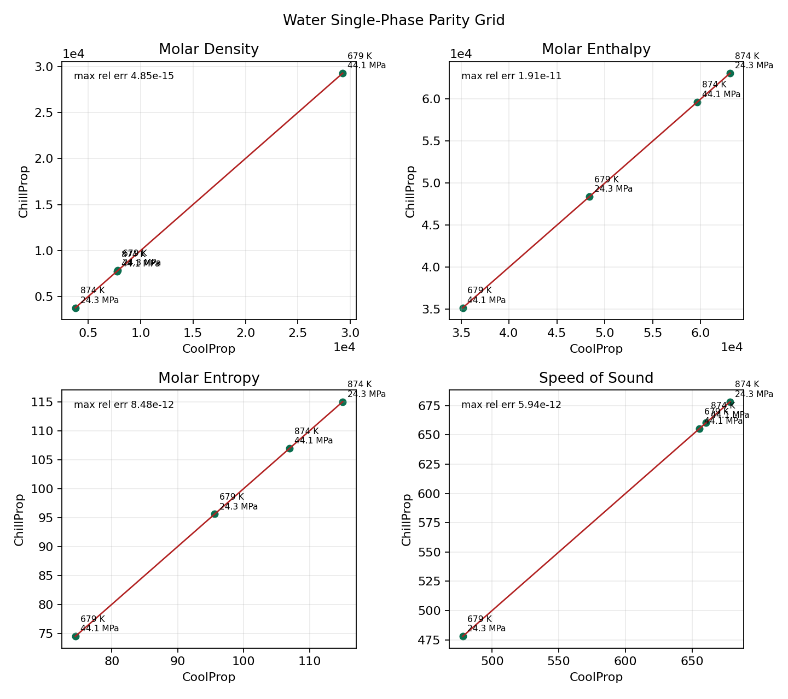

